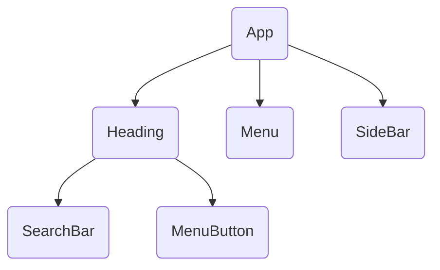

### React Components #core_react
- React Apps are built by combining components 

#### What are components
- Components are **functions** that **represent objects in the browser**.
	- E.g. *search bar*, *card*, *menu*
- React components **wrap HTML, JS** and posibly **CSS** into part of the UI

#### Advantages over Vanilla JS
- ==Can be Partialy Reused==
- ==Related code lives together==
	- I.e: CSS, JS, and HTML are all stored together

#### Rules for components
- **Custom components must start with a Uppercase char**
- **Component must return "Renderable Content**", 
	- The return value is usualy JSX.
	- But can also be string, num, bool, null, or an array.
---

[[Project File structure]]
### How React handles components
-	From index.js React file.
	o	**index.js /jsx** file acts as the main entrypoint of the react app
	o	it **contains no react components**
	o	it is the **first file loaded by the html file**
	o	it **uses** the **ReactDom library** **to create the entry point** and then rendering the JSX
	o	it **renders the JSX by passing your main App JSX component to the .render() method**
##### Eg. of index.js /jsx
```jsx
import ReactOm from "react-dom/client";
import App from "App.jsx";
import "./index.css";

const entryPoint = document.getElementById("root");
ReactDom.createRoot(entryPoint).render(<App/>);
```
- createRoot takes in an existing html element as an input, and makes it the root, from which JSX (React element) can be injected.
- .render() injects the JSX into a root-element, to be rendered in the html page.
- App Component may contain as many components as needed.

#### Root Component
- root component in react = ==App==

- **App – aka root component containing all other components**

#### User Created components vs built-in:
| Custom component              | Built-in component                         |
| ----------------------------- | ------------------------------------------ |
| ==name starts Uppercase==     | ==Name starts lowercase==                  |
| ==wraps built-in components== | only valid, official HTML elements allowed |

---
### React JSX (behind the scenes)
- ==**JSX is syntactic sugar for calling React.createElement()**==
![[Pasted image 20240523122231.png]]
- Here you can get an idea of what props looks like
- You can technically use React without jsx
---

### [[React Hooks#How React components are executed | How React Components Are Executed]]
---
### [[React Hooks#useState under the hood|useState hook under the hood]]

### Not all content must go into components
- ==You can still add content to the index.html file as normal html==
```html
<body>
	<header>
		<h1>This is inside the index.html file</h1>
	</header>
</body>
```
- If you have some static data which does not depend on state or components, you can add it into the index.html file
---
### [[Optimizing React]]
---